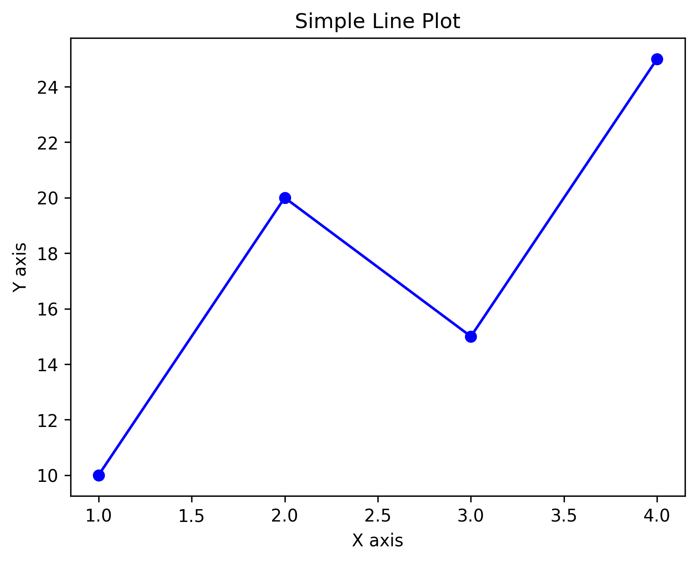

# Learning Matplotlib

A tiny set of Jupyter notebooks to learn and demo common Matplotlib workflows: basic plots, subplots, and saving figures.

## Contents
- `plots.ipynb` — basic plotting examples (line, scatter, styling)
- `subplots.ipynb` — arranging multiple plots with `plt.subplots`, shared axes, spacing
- `saving_figures.ipynb` — exporting figures (DPI, formats, `bbox_inches='tight'`)
- `line_plot.png` — sample PNG exported from the notebooks

Preview:



## Quick start (Windows PowerShell)
1) Create and activate a virtual environment

```powershell
py -m venv .venv
.\.venv\Scripts\Activate.ps1
python -m pip install --upgrade pip
```

2) Install dependencies

```powershell
pip install matplotlib notebook
```

Optional (often useful):

```powershell
pip install numpy
```

3) Launch Jupyter and open any notebook

```powershell
jupyter notebook
```

## Saving figures (snippet)
From a notebook cell, you can export high-quality figures in multiple formats:

```python
import matplotlib.pyplot as plt

fig, ax = plt.subplots(figsize=(6, 4))
ax.plot([0, 1, 2, 3], [0, 1, 0, 1], marker='o', label='demo')
ax.set_title('Demo line')
ax.legend()

# PNG with higher DPI and tight layout
fig.savefig('line_plot.png', dpi=200, bbox_inches='tight')

# Vector formats for print/scale
fig.savefig('figure.svg', bbox_inches='tight')
fig.savefig('figure.pdf', bbox_inches='tight')
```

Tips:
- Use `dpi` for raster clarity (e.g., 150–300 for print-quality PNG).
- Prefer `SVG`/`PDF` when you need crisp scaling (vector graphics).
- `bbox_inches='tight'` helps avoid clipped labels and legends.

## Repo structure
```
Learning-Matplotlib/
├─ plots.ipynb
├─ subplots.ipynb
├─ saving_figures.ipynb
└─ line_plot.png
```

## Troubleshooting
- If titles get clipped, try `fig.tight_layout()` or save with `bbox_inches='tight'`.
- In subplots, prefer `fig.suptitle('...')` (note spelling) for a figure-wide title.

---

Contributions welcome. If you add new examples, include a short note in this README under Contents.
